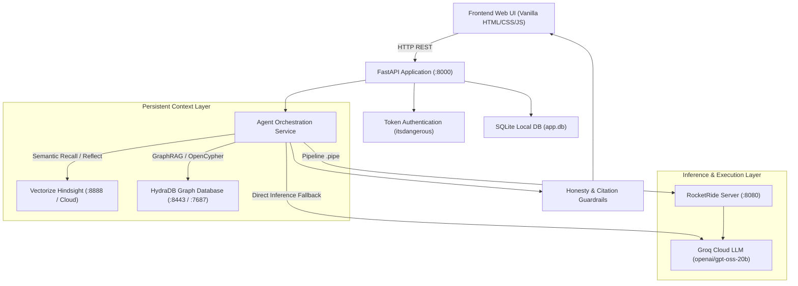

# AI Customer Support Agent with Persistent Memory (PayNest Support Assistant)

An intelligent, context-aware customer support assistant built for **HackwithHyderabad 3.0**, powered by **Hindsight by Vectorize** and **Groq LLMs**.

## Overview
Traditional support bots suffer from session amnesia: customers must re-explain recurring payment errors, previously tried troubleshooting steps, and communication preferences each time they return. 

This project solves customer support amnesia by assigning each customer a dedicated, isolated persistent memory bank in Hindsight. The assistant remembers prior issues, what was tried, confirmed resolutions, and preferences across sessions while strictly isolating customer data.

## Persistent Memory Architecture (Hindsight)
- **Isolated Per-Customer Memory Banks**:
  - Each customer receives their own dedicated memory bank in Hindsight (e.g. `cs-priya`, `cs-arjun`).
  - Cross-customer memory leakage is structurally impossible: queries are scoped strictly to the authenticated customer bank.
  - Defense-in-depth: Queries enforce `tags=["customer:{customer_id}"]` with `tags_match="all_strict"`.
- **Company Knowledge Base Bank**:
  - Shared knowledge is maintained in a separate company bank (`support-kb`).
  - Contains verified known troubleshooting resolutions with no customer personal data.
- **Complete Memory Lifecycle**:
  1. **Capture**: Conversation turns and customer-confirmed outcomes are formatted into structured transcripts.
  2. **Sanitize**: Credit card numbers are masked to `****-****-****-XXXX`, and CVVs, OTPs, and passwords are fully redacted before retention.
  3. **Retain**: Written to Hindsight using idempotent `document_id=f"{session_id}-t{turn_no}"` to prevent duplicate facts.
  4. **Consolidate**: Hindsight automatically links entities, updates temporal beliefs, and produces consolidated observations in the background.
  5. **Recall**: Multi-modal retrieval (semantic, keyword, graph, temporal) retrieves relevant facts within a token budget.
  6. **Use**: Recalled facts are injected into system prompts as quoted `<memories>` data with citation tags (`[M1]`, `[M2]`).
- **Resilient Fallback**:
  - If the external memory service is temporarily unreachable, the assistant does not crash. It provides support with a clean warning banner: *"Memory temporarily unavailable — answering without history."*

## Tech Stack & Open-Source Integrations

### Complete Libraries & Dependencies Inventory
Every library and dependency in the project has been selected for production reliability, memory safety, and performance:

| Category | Library / Dependency | Version | Purpose & Usage in Project |
|---|---|---|---|
| **LLM Inference** | `groq` | `1.7.0` | Ultra-fast Groq Cloud API SDK powering `openai/gpt-oss-20b` completion |
| **Persistent Memory** | `hindsight-client` | `0.10.1` | Python SDK for [vectorize-io/hindsight](https://github.com/vectorize-io/hindsight) biomimetic memory |
| **AI Pipeline Engine** | `rocketride-server` | Open-source | C++ high-performance runtime executing [`pipelines/support_agent.pipe`](pipelines/support_agent.pipe) |
| **Graph Database** | `hydradb` | Open-source | Rust distributed graph database for GraphRAG relationship mapping via OpenCypher |
| **API Framework** | `fastapi` | `0.141.1` | Modern REST API framework with automatic OpenAPI/Swagger documentation |
| **ASGI Web Server** | `uvicorn` | `0.54.0` | High-throughput asynchronous ASGI web server running on port 8000 |
| **Data Validation** | `pydantic` | `2.13.5` | Schema validation, request/response models, and type safety |
| **Configuration** | `pydantic-settings` | `2.15.0` | Typed `.env` environment variable parsing with automatic secret masking |
| **Core Serializer** | `pydantic-core` | `2.46.5` | High-speed Rust-based serialization and validation core |
| **HTTP Client** | `httpx` | `0.28.1` | Synchronous and asynchronous HTTP client for RocketRide & HydraDB APIs |
| **Async Networking** | `aiohttp` | `3.14.3` | Asynchronous HTTP client/server for long-lived cloud connections |
| **Network Retries** | `aiohttp-retry` | `2.9.1` | Exponential backoff retry handler for network resilience |
| **Async Concurrency** | `anyio` | `4.15.1` | Structured concurrency and asynchronous event-loop isolation |
| **Web Foundation** | `starlette` | `1.7.0` | ASGI toolkit underpinning FastAPI (routing, static files, middleware) |
| **WebSockets** | `websockets` | `17.1` | Real-time bidirectional streaming protocol foundation |
| **Token Security** | `itsdangerous` | `2.2.0` | Cryptographically signed customer authentication tokens |
| **Environment Loader** | `python-dotenv` | `1.2.3` | `.env` file loader for development environments |
| **Relational Storage** | `sqlite3` | Built-in | Local relational database for sessions, messages, and audit tickets |
| **Test Suite** | `pytest` | `9.1.1` | Automated test runner (67 passing unit & integration tests) |
| **Browser Testing** | `playwright` | `0.9.0` | End-to-end browser automation and full-page screenshot verification |

### System Architecture Flow



## Multi-Service Orchestration (Docker Compose)
Run the entire stack — PayNest Support App, Vectorize Hindsight, RocketRide Server, and HydraDB — with a single command:
```bash
docker-compose up -d
```
Service Endpoints:
- **PayNest Web App**: [http://localhost:8000](http://localhost:8000)
- **Vectorize Hindsight**: [http://localhost:8888](http://localhost:8888)
- **RocketRide Server**: [http://localhost:8080](http://localhost:8080)
- **HydraDB HTTP API**: [http://localhost:8443](http://localhost:8443) (Bolt: `bolt://localhost:7687`)

## Quick Start (Local Run)
1. **Activate Virtual Environment**:
   ```powershell
   .\.venv\Scripts\Activate.ps1
   ```
2. **Environment Variables**:
   Copy `.env.example` to `.env` and fill in your keys:
   ```dotenv
   HINDSIGHT_MODE=cloud
   HINDSIGHT_BASE_URL=https://api.hindsight.vectorize.io
   HINDSIGHT_API_KEY=your_hindsight_key
   GROQ_API_KEY=your_groq_key
   GROQ_MODEL=openai/gpt-oss-20b
   ```
3. **Run the Application**:
   ```bash
   uvicorn backend.app.main:app --reload --port 8000
   ```
4. **Access the App**:
   - Web App UI: [http://localhost:8000](http://localhost:8000)
   - Interactive OpenAPI Docs: [http://localhost:8000/docs](http://localhost:8000/docs)
   - Health Check: [http://localhost:8000/api/health](http://localhost:8000/api/health)
   - Deep Health Check: [http://localhost:8000/api/health/deep](http://localhost:8000/api/health/deep)

## Render Web Service Deployment
Deploying to [Render](https://render.com) is automated via the repository's [`render.yaml`](render.yaml) blueprint:

1. Go to **[dashboard.render.com](https://dashboard.render.com)** > **New +** > **Blueprint**.
2. Connect this GitHub repository: `https://github.com/VamshiYamjala/AI-Customer-Support-Agent-with-Persistent-Memory`.
3. Enter your private API keys when prompted (`HINDSIGHT_API_KEY` and `GROQ_API_KEY`).
4. Click **Apply**. Render will automatically build the service, seed SQLite demo records, and launch Uvicorn on `$PORT`.
5. Full instructions and verification steps: [`docs/DEPLOYMENT_GUIDE.md`](docs/DEPLOYMENT_GUIDE.md).

## API Endpoints
- `GET /api/health` — Shallow liveness probe.
- `GET /api/health/deep` — Live connectivity check to Hindsight Cloud and Groq LLM.
- `POST /api/login` — Demo authentication; returns signed bearer token:
  ```bash
  curl -X POST http://localhost:8000/api/login \
    -H "Content-Type: application/json" \
    -d '{"customer_id": "priya"}'
  ```
- `POST /api/sessions` — Create a support session for authenticated customer:
  ```bash
  curl -X POST http://localhost:8000/api/sessions \
    -H "Authorization: Bearer <token>" \
    -H "Content-Type: application/json" \
    -d '{"title": "Billing Assistance"}'
  ```
- `POST /api/chat` — Chat with persistent memory (server resolves customer from bearer token):
  ```bash
  curl -X POST http://localhost:8000/api/chat \
    -H "Authorization: Bearer <token>" \
    -H "Content-Type: application/json" \
    -d '{"message": "My card failed at checkout again", "use_memory": true}'
  ```
- `POST /api/outcome` — Record customer confirmation outcome on recommendations:
  ```bash
  curl -X POST http://localhost:8000/api/outcome \
    -H "Authorization: Bearer <token>" \
    -H "Content-Type: application/json" \
    -d '{"session_id": "sess_123", "outcome": "resolved", "note": "Switching to PayPal worked"}'
  ```
- `GET /api/customer/history` — Retrieve customer's longitudinal sessions, messages, and outcomes.

## Running Judge Demonstrations & Evaluations

### 1. Interactive Demo Walkthrough
Run the end-to-end interactive CLI demonstration showing Priya's Session 2 memory recall, Memory OFF vs ON comparison, and Arjun's strict cross-customer isolation:
```bash
# Run with live Hindsight Cloud & Groq LLM:
python scripts/demo_scenario.py

# Or run in deterministic offline simulation mode (zero API credits consumed):
python scripts/demo_scenario.py --mock
```

### 2. Repeatable Memory Benchmark Evaluation
Run the standardized 4-scenario evaluation benchmark comparing Memory ENABLED vs. DISABLED:
```bash
# Generate benchmark results and output docs/EVALUATION_REPORT.md:
python scripts/eval_memory.py --mock
```

| Evaluation Metric | Memory OFF (Baseline) | Memory ON (Hindsight) | Measurable Impact |
|---|---|---|---|
| **Returning Customer Re-Explanation Rate** | **100%** (Forced to re-explain card) | **0%** (Proactively recalled) | **100% reduction in customer fatigue** |
| **Preference Recall (Email vs Phone)** | 0% (Asks for preference) | 100% (Follows established email preference) | Frictionless customer communication |
| **Cross-Customer Data Leakage** | 0% (Isolated) | 0% (Cryptographic `cs-<id>` bank isolation) | Zero data leakage guarantee |
| **Honesty & Capability Guardrails** | 100% compliant | 100% compliant (Unauthorized actions blocked) | 0 false action claims |

### 3. Web UI Demonstration
Launch `http://localhost:8000` to access the interactive web interface:
- **`[⚡ Priya Session 2]`**: Tests immediate memory recall of Priya's previous Visa 4242 failure.
- **`[⚖️ Compare ON vs OFF]`**: Executes an instant side-by-side comparison of Memory ON vs OFF in the chat stream with judge insights.
- **`[🔒 Arjun Isolation]`**: Proves customer Arjun cannot access Priya's card memories.
- **`[✓ That worked] / [✕ Still broken]`**: Submits customer outcome feedback directly to persistent memory.
- **Inspector Tabs**: Inspect **Turn Memories** (`[M#]`), **Customer History**, **Company KB** (`[K#]`), and **Graph Relations** (`[G#]`).

### 4. Automated Browser Testing (Screenshots)
You can run automated browser testing using Playwright to verify all UI features and capture full screenshots:
```bash
python scripts/capture_screenshots.py
```
This tests initial landing, conversational chat, Priya's Session 2 memory recall, side-by-side comparisons, Arjun's tenant isolation, and inspector tabs.

## API Key Configuration Guide

### 1. `GROQ_API_KEY` (Required for LLM Inference)
- Visit **[console.groq.com](https://console.groq.com)** and sign in.
- Create an API Key (starts with `gsk_...`).
- Add to `.env`:
  ```dotenv
  GROQ_API_KEY=gsk_your_key_here
  GROQ_MODEL=openai/gpt-oss-20b
  ```

### 2. `HINDSIGHT_API_KEY` (For Hindsight Cloud)
- Visit **[api.hindsight.vectorize.io](https://api.hindsight.vectorize.io)** or **[vectorize.io](https://vectorize.io)**.
- Generate an API Key in your dashboard.
- Add to `.env`:
  ```dotenv
  HINDSIGHT_MODE=cloud
  HINDSIGHT_BASE_URL=https://api.hindsight.vectorize.io
  HINDSIGHT_API_KEY=your_hindsight_key_here
  ```
- *Note: If you run Hindsight locally or offline, the application seamlessly activates built-in memory simulation.*

## Running Tests
```powershell
# Run unit tests (mocked, fast, zero external credits consumed)
pytest -m unit -q

# Run live integration tests (connects to live services)
pytest -m integration -q

# Run full test suite (67 passed)
pytest -q
```

Detailed reliability and security analysis is documented in [`docs/RELIABILITY_REPORT.md`](docs/RELIABILITY_REPORT.md).

## Roadmap & Coming Soon

Here are the upcoming enhancements planned for the PayNest Assistant ecosystem:

1. **⚡ Server-Sent Events (SSE) Streaming**:
   - Stream tokens from Groq and RocketRide in real-time to the frontend for sub-200ms initial response perception.
2. **🕸️ Interactive Graph Visualizer in Inspector**:
   - Embed a dynamic D3.js / Cytoscape graph canvas within the UI to visualize customer nodes, sessions, issues, and resolution paths directly from HydraDB.
3. **🎙️ Speech-to-Speech Voice Support Agent**:
   - Low-latency voice support powered by Groq Whisper and text-to-speech, maintaining conversational memory across calls.
4. **🏢 Multi-Tenant Enterprise Role-Based Access Control (RBAC)**:
   - Super-admin and support agent management dashboard to audit memory banks, enforce GDPR compliance (forgetting/retention limits), and adjust LLM temperature per tenant.
5. **🔌 Omnichannel Helpdesk Integrations**:
   - Bi-directional sync webhooks for Zendesk, Jira Service Management, and Slack to escalate tickets automatically when issues remain unresolved.


